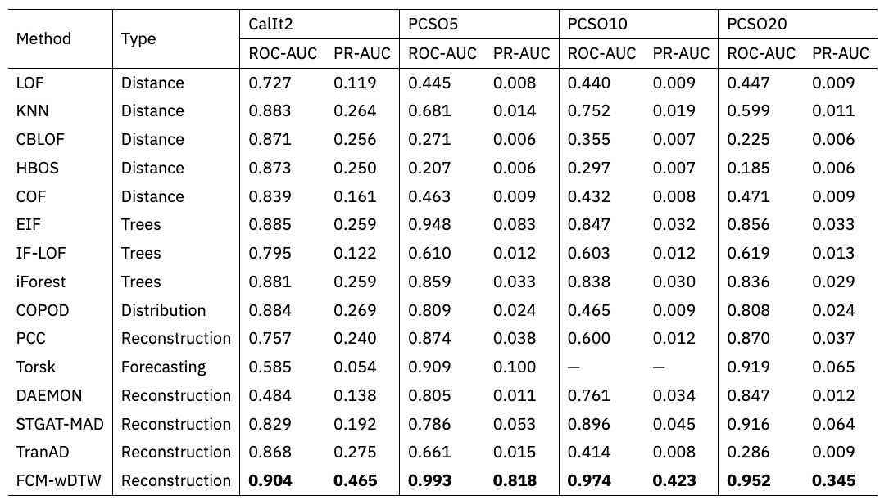
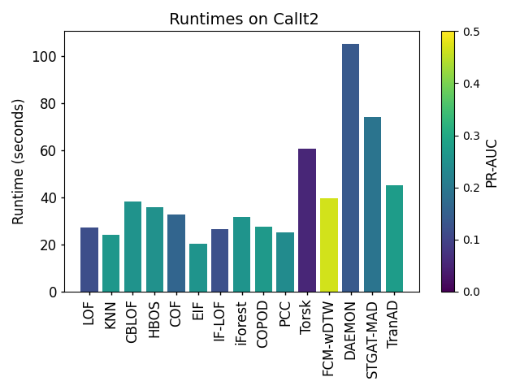
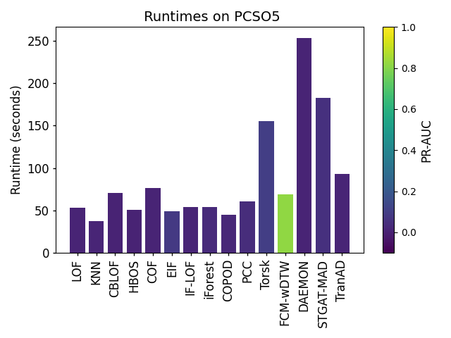

# Source code for “Unsupervised Distance Metric Learning for Anomaly Detection over Multivariate Time Series”

## Dependencies

- Numba 0.50.1
- Scikit-learn 1.3.2
- Pandas 1.3.2
- NumPy 1.21.0

You can install the dependencies using the following command:

```bash
pip install numba==0.50.1 scikit-learn==1.3.2 pandas==1.3.2 numpy==1.21.0
```

## Running the Experiment

To run the experiment on CalIt2, execute the following command:

```
python anomaly.py
```

## Experiment Results

### Anomaly Detection

The experiment results on anomaly detection are as follows:



### Runtime Comparison

Runtime comparisons on two representative datasets CalIt2 and PCSO are as follows:

<center class="half">
</center>
